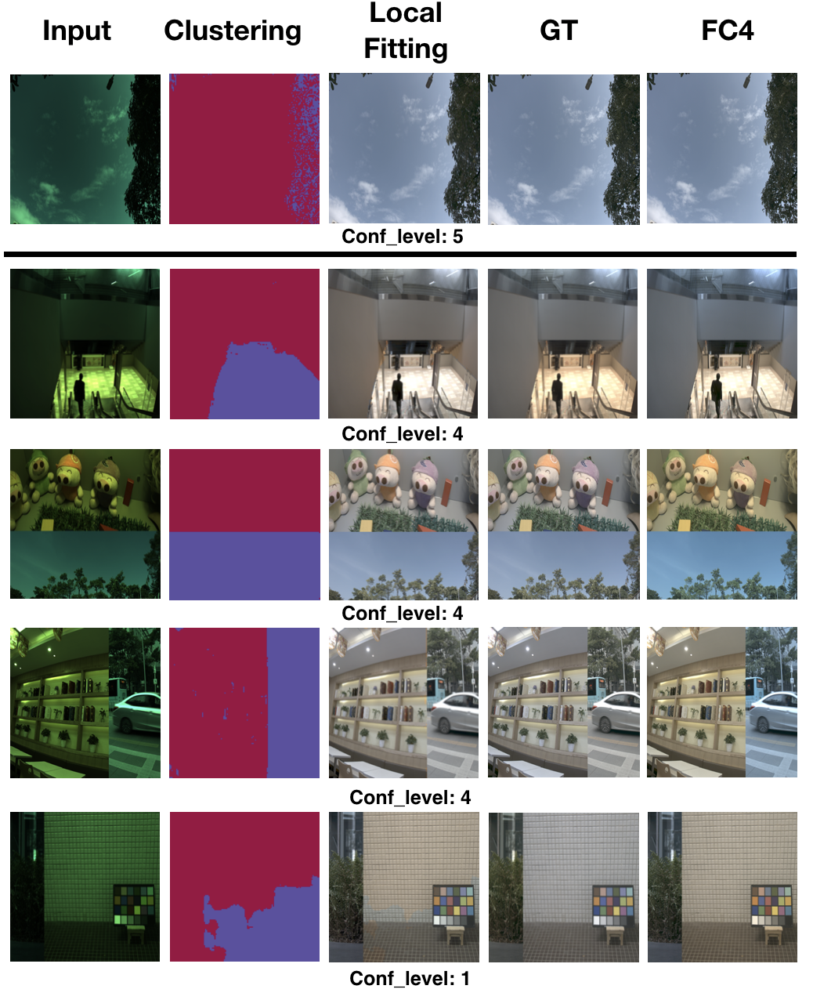

# Kernel Prediction Framework for White Balance
[Arxiv](https://arxiv.org/abs/1902.04705)

Tensorflow implementation for predicting kernels for white balancing task. Usually global mapping is used for white balancing. However, it may face difficulties to fit multi-light-souces scene. This project proposes a local mapping method for white balancing task. Samples:

In this project, we train a network to predict different kernels for different positions in input image, which gives us the locally mapping ability while maintaining the global consistancy. The designed framework also outputs each fittings confidence value for further analysis. The clustering here presents for a visualization of locally fitted values (gain vectors). (The clustering mask above shows result of cluster number of 2.)

## Prerequisites
## Dataset

## Citation
    @article{liu2019self,
        title={Self-adaptive Single and Multi-illuminant Estimation Framework based on Deep Learning},
        author={Liu, Yongjie and Shen, Sijie},
        journal={arXiv preprint arXiv:1902.04705},
        year={2019}
    }
